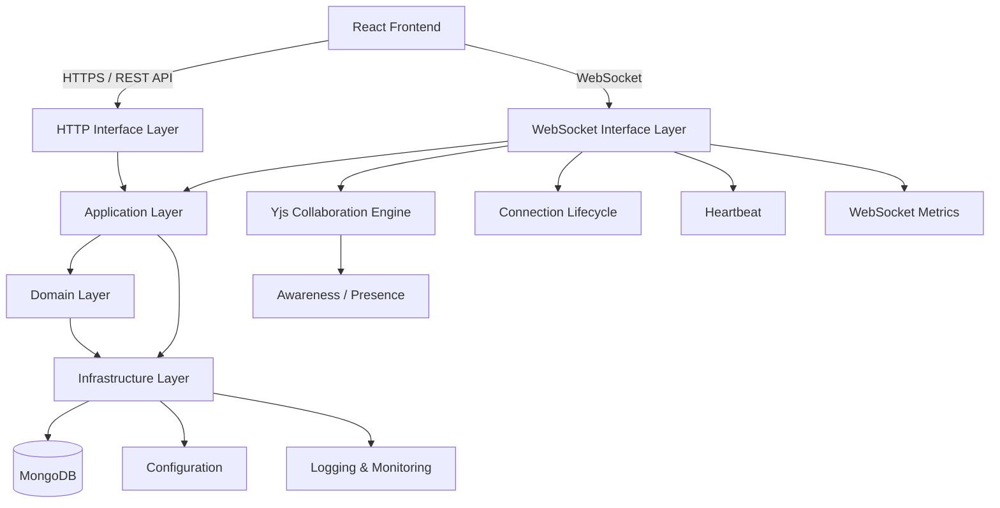

# 🧩 Kanban-Collab: Real-Time Collaborative Kanban Platform

**Kanban-Collab** is a real-time collaborative task management platform designed to help teams organize projects, manage boards, and work together seamlessly.

Unlike a traditional Kanban application where users refresh the page to see changes, Kanban-Collab is built around **real-time collaboration**. Multiple users can work on the same board while changes are synchronized across connected clients through a dedicated WebSocket layer powered by **Yjs**.

The project is engineered with a strong focus on **clean architecture, separation of responsibilities, real-time synchronization, security, scalability, and maintainability**.

The system is divided into independent layers for HTTP communication, WebSocket collaboration, business logic, persistence, configuration, and shared infrastructure.

---

## 🎯 Project Goals

Kanban-Collab was built to explore how a production-oriented collaborative application can be designed beyond basic CRUD operations.

The primary goals are:

* Build a real-time collaborative Kanban experience.
* Allow multiple users to work on boards simultaneously.
* Keep HTTP APIs and WebSocket communication clearly separated.
* Synchronize collaborative state efficiently using Yjs.
* Maintain a clean separation between business logic and infrastructure.
* Build reusable authentication, validation, error-handling, and logging systems.
* Design the backend so individual components can evolve independently.
* Establish a foundation that can scale as collaboration features become more complex.

---

## ✨ Core Features

### 📋 Workspace & Board Management

Kanban-Collab organizes work around **workspaces and boards**.

Users can:

* Create and manage workspaces.
* Create boards inside workspaces.
* Organize tasks using Kanban-style workflows.
* Navigate between active workspaces and boards.
* Maintain a structured project hierarchy.

The frontend follows a dashboard-oriented architecture where workspace, navigation, boards, and application content are separated into reusable components.

---

### ⚡ Real-Time Collaboration

Real-time collaboration is one of the core engineering challenges of the project.

The application uses a dedicated WebSocket layer to handle collaborative communication between connected clients.

The collaboration system includes:

* WebSocket connection lifecycle management.
* Client connection and disconnection handling.
* Heartbeat mechanisms.
* Collaboration events.
* Awareness state.
* Document management.
* Yjs-based synchronization.
* Idle connection cleanup.
* WebSocket middleware.
* Collaboration metrics and monitoring.

This allows multiple users to interact with the same collaborative document without relying entirely on traditional REST requests.

---

### 🧠 Yjs-Based Synchronization

The collaboration engine uses **Yjs** to manage shared state between clients.

Instead of treating every board update as an isolated HTTP request, collaborative state can be synchronized through a shared Yjs document.

Conceptually:

```text
User A
   │
   ▼
React Application
   │
   ▼
Yjs Document
   │
   ▼
WebSocket Layer
   │
   ├──────────────► User B
   │
   ├──────────────► User C
   │
   └──────────────► User D
```

This architecture provides a foundation for conflict-aware collaborative editing and allows the application to move toward richer real-time interactions.

---

### 👥 Awareness & Presence

The collaboration layer also maintains **awareness information** for connected users.

This provides the foundation for features such as:

* Active collaborators.
* User presence.
* Connection state.
* Collaborative awareness.
* Future cursor and selection indicators.

The awareness system is kept separate from the core document synchronization logic so both concerns can evolve independently.

---

### 🔐 Authentication & Security

Authentication is treated as a first-class part of the architecture rather than being scattered throughout controllers.

The system includes dedicated layers for:

* Authentication.
* Authorization.
* HTTP middleware.
* WebSocket middleware.
* Request validation.
* Secure configuration.
* Error handling.
* Session/token management.

The goal is to ensure that both **HTTP requests and WebSocket connections** pass through appropriate security boundaries before accessing protected resources.

---

### 🛡️ Validation & Error Handling

The backend uses centralized mechanisms for handling invalid requests and application failures.

Instead of allowing every controller or service to implement its own error behavior, the architecture provides shared infrastructure for:

* Request validation.
* Application errors.
* HTTP error responses.
* WebSocket errors.
* Consistent API responses.
* Unexpected server failures.

This keeps business logic cleaner and makes debugging easier as the system grows.

---

### 📊 Logging & Monitoring

The system is designed with observability in mind.

Important application events can be tracked through dedicated logging and monitoring infrastructure.

The architecture accounts for:

* Application logs.
* WebSocket connection metrics.
* Collaboration metrics.
* Error tracking.
* Connection lifecycle events.
* Heartbeat monitoring.
* Server health information.

This becomes particularly important in a real-time system where a problem may occur across multiple connected clients rather than a single HTTP request.

---

# 🏗️ System Architecture

Kanban-Collab follows a **layered architecture** that separates business rules from infrastructure and communication mechanisms.



The important architectural principle is that **communication mechanisms are kept separate from business logic**.

HTTP controllers should not contain domain rules.

WebSocket handlers should not become repositories.

Database implementations should not define application behavior.

Instead, each layer has a focused responsibility.

---

# 🔄 HTTP & WebSocket Architecture

One of the important design decisions in Kanban-Collab is treating **HTTP and WebSocket communication as separate interface layers**.

```text
                    ┌──────────────────────┐
                    │      React Client    │
                    └──────────┬───────────┘
                               │
                 ┌─────────────┴─────────────┐
                 │                           │
              HTTP                        WebSocket
                 │                           │
                 ▼                           ▼
        ┌────────────────┐         ┌──────────────────┐
        │ HTTP Interface │         │ WebSocket Layer  │
        └───────┬────────┘         └────────┬─────────┘
                │                           │
                ▼                           ▼
        Application Layer          Collaboration Layer
                │                           │
                └────────────┬──────────────┘
                             ▼
                     Domain / Business
                           Logic
                             │
                             ▼
                      Infrastructure
                             │
                             ▼
                         MongoDB
```

This separation prevents real-time communication concerns from leaking into ordinary HTTP controllers and application services.

---

# 🧱 Backend Architecture

The backend is organized around several major layers.

### Domain Layer

Contains the core business concepts and rules.

```text
domain/
```

The Domain layer should remain independent from frameworks and external infrastructure.

---

### Application Layer

Contains application-specific use cases and orchestration.

```text
application/
```

This layer coordinates domain logic and infrastructure without directly coupling business rules to Express, MongoDB, or WebSocket implementations.

---

### Infrastructure Layer

Contains external implementations and technical infrastructure.

```text
infrastructure/
```

Examples include:

* Database access.
* MongoDB/Mongoose implementations.
* Configuration.
* Logging.
* External infrastructure services.

---

### Interface Layer

Contains the ways external clients communicate with the application.

```text
interfaces/
├── http/
└── websockets/
```

HTTP and WebSocket communication are deliberately separated.

---

# 🔌 WebSocket Architecture

The WebSocket subsystem has its own internal structure:

```text
interfaces/websockets/

├── bootstrap/
├── collaboration/
├── events/
├── heartbeat/
├── lifecycle/
├── middlewares/
├── persistence/
├── server/
├── utils/
├── yjs/
├── awareness/
├── metrics/
└── types/
```

Each area has a focused responsibility.

### Collaboration

Handles the collaborative communication between connected clients.

### Events

Provides structured event handling for WebSocket communication.

### Heartbeat

Maintains connection health and detects inactive clients.

### Lifecycle

Controls connection initialization, cleanup, and shutdown behavior.

### Yjs

Contains the Yjs document synchronization infrastructure.

### Awareness

Handles collaborative presence information.

### Metrics

Provides visibility into WebSocket and collaboration activity.

### Persistence

Provides the foundation for persisting collaborative state when required.

---

# 🌐 HTTP Architecture

The HTTP layer follows a similarly structured approach:

```text
interfaces/http/

├── controllers/
├── routes/
├── middleware/
└── validators/
```

### Controllers

Handle HTTP requests and responses.

### Routes

Define API endpoints and connect them to controllers.

### Middleware

Handles cross-cutting concerns such as authentication, authorization, errors, and request processing.

### Validators

Validate incoming data before it reaches application logic.

This keeps controllers small and focused.

---

# 📂 Project Structure

The repository is organized around architectural responsibilities rather than simply grouping files by technical type.

```bash
kanban-collab/
│
├── client/                         # React frontend
│   ├── src/
│   │   ├── api/                    # API clients
│   │   ├── app/                    # Application providers & router
│   │   ├── components/             # Reusable UI components
│   │   ├── features/               # Feature-based frontend modules
│   │   │   ├── auth/
│   │   │   ├── boards/
│   │   │   └── workspaces/
│   │   ├── hooks/                  # Custom React hooks
│   │   ├── types/                  # Shared frontend types
│   │   └── ...
│   │
│   └── package.json
│
├── server/                         # Backend application
│   ├── src/
│   │   ├── config/                 # Application configuration
│   │   │
│   │   ├── shared/                 # Shared infrastructure/utilities
│   │   │
│   │   ├── application/            # Application/use-case layer
│   │   │
│   │   ├── domain/                 # Core business logic
│   │   │
│   │   ├── infrastructure/         # Database & external infrastructure
│   │   │
│   │   ├── interfaces/
│   │   │   │
│   │   │   ├── http/
│   │   │   │   ├── controllers/
│   │   │   │   ├── routes/
│   │   │   │   ├── middleware/
│   │   │   │   └── validators/
│   │   │   │
│   │   │   └── websockets/
│   │   │       ├── bootstrap/
│   │   │       ├── collaboration/
│   │   │       ├── events/
│   │   │       ├── heartbeat/
│   │   │       ├── lifecycle/
│   │   │       ├── middlewares/
│   │   │       ├── persistence/
│   │   │       ├── server/
│   │   │       ├── utils/
│   │   │       ├── yjs/
│   │   │       ├── awareness/
│   │   │       ├── metrics/
│   │   │       └── types/
│   │   │
│   │   └── ...
│   │
│   ├── package.json
│   └── ...
│
└── README.md
```

---

# 🛠️ Technical Stack

| Category               | Technology                              | Purpose                                   |
| :--------------------- | :-------------------------------------- | :---------------------------------------- |
| **Frontend**           | React, TypeScript, Vite                 | Interactive collaborative dashboard       |
| **Styling**            | Tailwind CSS                            | Responsive application UI                 |
| **Backend**            | Node.js, TypeScript                     | Application server                        |
| **HTTP**               | Express.js                              | REST API layer                            |
| **Database**           | MongoDB, Mongoose                       | Persistent application data               |
| **Real-Time**          | WebSocket                               | Bidirectional client-server communication |
| **Collaboration**      | Yjs                                     | Shared collaborative document state       |
| **Presence**           | Yjs Awareness                           | Real-time collaborator awareness          |
| **Authentication**     | JWT-based authentication                | Secure user sessions                      |
| **Validation**         | TypeScript validation layer             | Request/data validation                   |
| **Architecture**       | Layered / Clean Architecture principles | Separation of responsibilities            |
| **Package Management** | npm                                     | Dependency management                     |
| **Version Control**    | Git / GitHub                            | Source control and collaboration          |

---

# ⚙️ Application Flow

A typical board interaction follows a flow similar to:

```text
User
 │
 ▼
React UI
 │
 ├─────────────── HTTP ───────────────► API
 │                                       │
 │                                       ▼
 │                                Application Layer
 │                                       │
 │                                       ▼
 │                                  Domain Logic
 │                                       │
 │                                       ▼
 │                                   Database
 │
 │
 └──────────── WebSocket ─────────────► Collaboration Server
                                          │
                                          ▼
                                      Yjs Document
                                          │
                              ┌───────────┼───────────┐
                              ▼           ▼           ▼
                            User A      User B      User C
```

This allows the application to use the right communication mechanism for the right job.

**HTTP** handles conventional application operations.

**WebSockets + Yjs** handle continuous collaborative synchronization.

---

# 🔐 Security Architecture

Security is considered across both communication layers.

The application is designed around:

* Authentication middleware.
* Protected HTTP routes.
* WebSocket authentication.
* Request validation.
* Centralized error handling.
* Controlled configuration.
* Environment-based secrets.
* Separation between application logic and infrastructure.
* Controlled access to collaborative resources.

A key design goal is ensuring that WebSocket connections are not treated as an unauthenticated side channel.

---

# 🧪 Testing Strategy

Testing is organized alongside the architecture so individual layers can be tested independently.

The project provides a foundation for testing:

* Domain logic.
* Application use cases.
* HTTP controllers.
* HTTP routes.
* Validation.
* WebSocket behavior.
* Collaboration logic.
* Connection lifecycle.
* Persistence implementations.

The long-term goal is to maintain confidence in both the traditional request/response path and the more complex real-time collaboration path.

---

# 📈 Scalability Considerations

Kanban-Collab is being developed with scalability in mind.

Some of the architectural decisions supporting this are:

### Separation of Concerns

Business logic does not depend directly on Express, MongoDB, or WebSocket implementations.

### Dedicated WebSocket Layer

Real-time communication is isolated from the HTTP API.

### Modular Collaboration System

Yjs, awareness, lifecycle management, heartbeat, persistence, and metrics are separated into focused modules.

### Infrastructure Abstraction

Database and external infrastructure concerns are kept outside the core domain.

### Stateless HTTP Design

HTTP application logic can be structured independently from persistent connection state.

### Connection Lifecycle Management

Idle connections and heartbeat behavior are explicitly handled rather than being left to the underlying transport.

These decisions make it easier to evolve the application as the number of users, boards, and concurrent collaborators grows.

---

# 🚀 Local Development

## Prerequisites

Make sure the following are installed:

* **Node.js**
* **npm**
* **MongoDB**
* **Git**

---

## 1. Clone the Repository

```bash
git clone <your-repository-url>
cd kanban-collab
```

---

## 2. Install Backend Dependencies

```bash
cd server
npm install
```

---

## 3. Configure Backend Environment

Create a `.env` file inside the `server` directory.

```env
NODE_ENV=development
PORT=8000

MONGODB_URI=your_mongodb_connection_string

JWT_ACCESS_SECRET=your_access_secret
JWT_REFRESH_SECRET=your_refresh_secret

CORS_ORIGIN=http://localhost:5173
```

Add any additional environment variables required by the current configuration.

---

## 4. Start the Backend

```bash
npm run dev
```

The backend will start in development mode.

---

## 5. Install Frontend Dependencies

Open another terminal:

```bash
cd client
npm install
```

---

## 6. Configure Frontend Environment

Create:

```text
client/.env
```

Example:

```env
VITE_API_URL=http://localhost:8000
VITE_WS_URL=ws://localhost:8000
```

Use the exact environment variable names defined by the current frontend configuration.

---

## 7. Start the Frontend

```bash
npm run dev
```

The React application will start through Vite.

---

# 🧭 Development Roadmap

Kanban-Collab is being developed incrementally.


---

# 💡 Engineering Focus

Kanban-Collab is more than a Kanban board.

The project is primarily an exploration of how to build a **maintainable real-time system** where traditional APIs and persistent WebSocket connections coexist cleanly.

The most important engineering challenges include:

* Designing clean boundaries between layers.
* Managing persistent WebSocket connections.
* Synchronizing shared state between clients.
* Handling connection failures and reconnections.
* Managing collaborative awareness.
* Cleaning up inactive connections.
* Keeping real-time infrastructure maintainable.
* Separating domain logic from technical infrastructure.
* Designing APIs that remain predictable as the application grows.

---

# 👨‍💻 Author

**Raj Mishra**

Full-Stack Developer focused on building scalable applications, backend architecture, real-time systems, and developer-oriented software.


---

> **Kanban-Collab is built around a simple idea:**
>
> *Teams should not have to wait for the screen to catch up with the work.*
>
> Real-time collaboration turns a collection of individual actions into a shared workspace where everyone can see the project evolve together.
