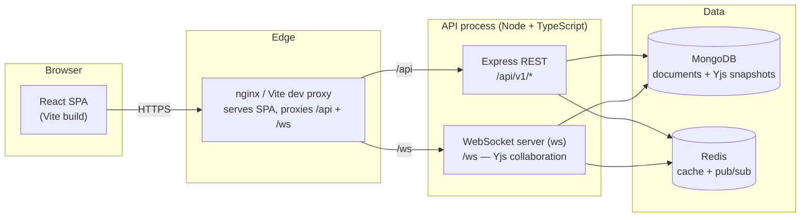
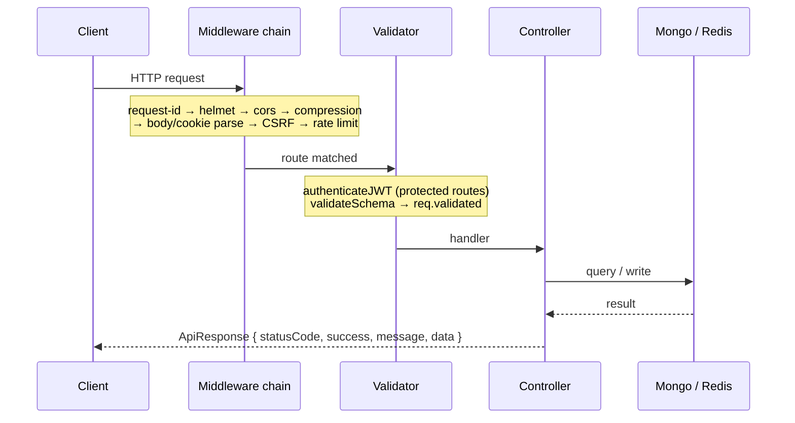

# Architecture

This document explains how Kanban-Collab is put together: the layers, the request lifecycle, and the technology choices. For the data model see [Data Model](data-model.md); for the real-time layer see [Real-time Collaboration](realtime-collaboration.md).

## System overview



The API process serves **both** the REST API and the WebSocket collaboration channel from the same HTTP server (the WS server runs in `noServer` mode and attaches to the `upgrade` event). MongoDB is the system of record; Redis backs caching and (by design) cross-instance fan-out for the collaboration layer.

## Technology stack

**Server** (`server/`):

| Concern | Choice |
|---|---|
| Runtime / language | Node.js ≥ 22, TypeScript (strict, `exactOptionalPropertyTypes`) |
| HTTP | Express 4 |
| Validation | Zod 4 (one schema per route, applied by middleware) |
| Database | MongoDB via Mongoose 8 |
| Cache / pub-sub | Redis (`redis` v4) |
| Auth | `jsonwebtoken` (JWT), `bcrypt` |
| Real-time | `ws` + `yjs` + `y-websocket` + `y-protocols` |
| Logging | `pino` (+ `pino-roll`) |
| Scheduling | `node-cron` |
| Hardening | `helmet`, `express-rate-limit`, `compression`, `cookie-parser` |

**Client** (`client/`):

| Concern | Choice |
|---|---|
| UI | React 19 + TypeScript, Vite |
| Routing | React Router 7 |
| Server state | TanStack Query |
| Client state | Zustand |
| Styling | Tailwind CSS 4 |
| HTTP | axios |
| Real-time | `yjs` + `y-protocols` |

## Repository layout

```
server/src/
├── application/          Use-cases (auth, dashboard, notifications, workspace deletion)
├── config/               env.ts (Zod-validated), oauth.ts, websocket.ts
├── infrastructure/       db/mongoose, security (jwt/password/token), auth providers,
│                         cache, logging, scheduler
├── interfaces/
│   ├── http/             app.ts, controllers/, middleware/, routes/, validators/, utils/
│   └── websockets/       bootstrap/, collaboration/ (yjs, persistence, awareness,
│                         heartbeat, lifecycle, metrics), middlewares/, server/
├── jobs/                 Cron jobs (digest, due reminder, self-ping, workspace cleanup,
│                         Yjs snapshot)
├── shared/               errors/, utils/ (ApiError, ApiResponse, asyncHandler),
│                         constants/, types/
└── main.ts               Boot: connect infra → start HTTP+WS → start cron

client/src/
├── api/                  axios client + per-domain API modules
├── app/                  App shell, router, providers, layouts
├── collaboration/        Yjs provider, boardDoc, useBoardDoc, useCursors, awareness
├── components/           UI + layout (board, dashboard, marketing)
├── features/             Feature modules (auth, boards, dashboard, notes, settings, …)
├── hooks/                React Query wrappers
├── stores/               Zustand stores
├── types/                Shared types
└── validations/          Zod schemas mirrored from the server
```

## Server layers

The server follows a layered structure. Each layer only depends on the ones below it.

| Layer | Path | Responsibility |
|---|---|---|
| HTTP interface | `interfaces/http` | Express app, routing, controllers, middleware, request validation, cookies |
| WebSocket interface | `interfaces/websockets` | Upgrade handling, auth, Yjs document management, persistence, presence, heartbeat |
| Application | `application` | Use-cases that orchestrate infrastructure (login, refresh, dashboard, notifications) |
| Infrastructure | `infrastructure` | Mongoose models, JWT/password hashing, OAuth providers, Redis, logging, cron |
| Shared | `shared` | `ApiError`/`ApiResponse`, `asyncHandler`, error normalisation, constants, types |
| Config | `config` | Environment (`env.ts`), OAuth and WebSocket configuration |

**A note on layering:** the layering is real but uneven — only auth, dashboard, notifications and workspace-deletion have a dedicated `application` layer. **Most business logic lives in the HTTP controllers**, which then call Mongoose models directly. Treat the `application/` folder as "use-cases that grew complex enough to extract", not as a strict rule.

## Request lifecycle



1. **Global middleware** — request-id, `helmet` security headers, CORS, compression, JSON/urlencoded body parsing (1 MB limit), cookie parsing.
2. **CSRF** — `issueCsrfCookie` guarantees a double-submit cookie; `csrfProtection` rejects unsafe methods without a matching `X-CSRF-Token` header (credential-establishing endpoints are exempt).
3. **Rate limiting** — a global limiter, plus a stricter limiter on `/api/v1/auth`.
4. **Routing** — matched against the mounted routers (see [API Reference](api-reference.md)).
5. **Auth** — protected routers apply `authenticateJWT`; controllers additionally guard `req.user`.
6. **Validation** — `validateSchema` parses `body`/`params`/`query` against Zod schemas. Note: results are placed on `req.validated`; controllers that read `req.body` directly do not get Zod's coercions/defaults.
7. **Controller** — wrapped in `asyncHandler` so thrown/rejected errors flow to the error middleware. Success responses are built with `ApiResponse`.
8. **Errors** — anything thrown is normalised by `normalizeError` into an `ApiError` and rendered by `errorHandler` (see below).

## Response envelope

Every successful response has the same shape:

```json
{ "statusCode": 200, "success": true, "message": "…", "data": { } }
```

Every error response:

```json
{ "statusCode": 404, "success": false, "message": "Not Found", "code": "BOARD_NOT_FOUND", "errors": null, "data": null }
```

`code` is a machine-readable identifier; `stack` is included **only** in development for non-operational errors.

## Error model

- `ApiError` (`shared/utils/ApiError.ts`) carries `statusCode`, `message`, optional `code`/`errors`/`data`, and an `isOperational` flag.
- `normalizeError` maps framework errors (Mongoose, JWT, Zod, multer, rate-limit, Redis) into `ApiError` so the handler has one shape to work with.
- `errorHandler` (`interfaces/http/middleware/errorHandler.ts`) logs at `warn` for operational errors (expected 4xx) and `error` for the rest, then emits the error envelope. Stack traces are never exposed in production.

## WebSocket lifecycle

In brief (full detail in [Real-time Collaboration](realtime-collaboration.md)):

1. The HTTP server emits `upgrade`; `handleUpgrade` parses the request, authenticates the token, and authorises the user for the board.
2. `documentManager.getOrCreate(boardId)` loads or creates the Yjs document (seeded from MongoDB).
3. The client is registered, the update broadcaster is attached, and a Yjs **sync step 1** is sent.
4. Inbound binary messages are decoded and dispatched (sync / awareness).
5. On close, the client is removed and idle cleanup is scheduled; on process shutdown, all documents are persisted and destroyed.

## Configuration & boot

`src/config/env.ts` defines a Zod schema for every environment variable and validates `process.env` at import time. A missing or invalid **required** variable prints each offending field and exits with code 1 — so a misconfigured server fails fast and loudly rather than at first use. `.env.example` documents every variable and the cross-field rules (OAuth all-or-nothing, `EMAIL_PROVIDER=smtp` requires host+user, etc.).

`main.ts` boots in order: connect MongoDB → connect Redis → start the HTTP + WebSocket server → start cron jobs. It installs `SIGINT`/`SIGTERM` handlers and a force-exit safety net, and treats `uncaughtException`/`unhandledRejection` as fatal (log, then shut down).

## Logging & observability

- **`pino`** with child loggers per module (`httpLogger`, `authLogger`, `yjsLogger`, `websocketLogger`, …), so log lines carry a `module`/`component` tag.
- **Request ids** are attached to every request and echoed in logs and error responses.
- **Health probes**: `/healthz` (liveness) and `/readyz` (readiness — checks Mongo and Redis).
- **Metrics**: a Prometheus endpoint (`PROMETHEUS_ENABLED`, default `/metrics`) and optional OpenTelemetry (`OTEL_ENABLED`).

## Design principles

- **Validate at the boundary.** Every route has a Zod schema; invalid input never reaches a controller.
- **One error path.** Controllers throw; a single handler turns anything into the standard error envelope.
- **One success shape.** Controllers return `ApiResponse`; clients can rely on `{ success, message, data }`.
- **Fail fast on config.** The environment is validated at boot, not lazily.
- **Separate HTTP and real-time concerns.** REST and the Yjs collaboration channel are distinct layers that share only infrastructure.
