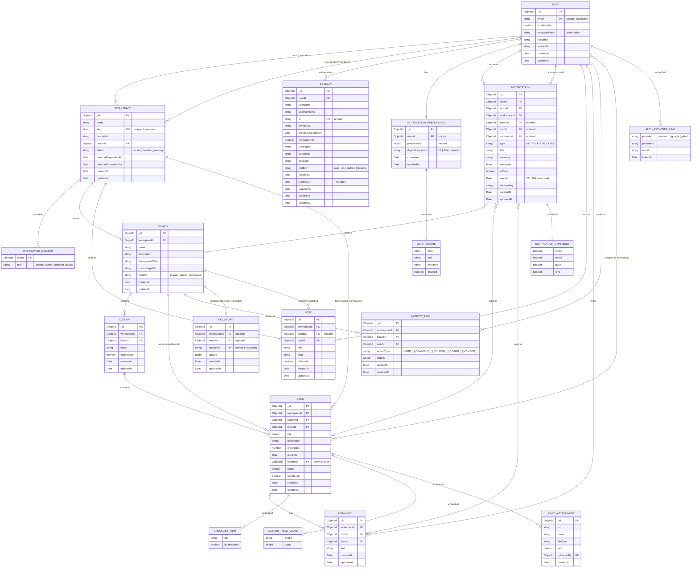

# Data Model

The persistence layer is MongoDB, modelled with Mongoose. All definitions live in one file — **`server/src/infrastructure/db/mongoose/schemas.ts`** — and every model uses `{ timestamps: true }` (`createdAt` / `updatedAt`).

MongoDB has **no enforced foreign keys**: the links below are `ObjectId` references (`ref`) except where marked *embedded* (a sub-document stored inside its parent).

## ER diagram

## Collections

| # | Collection | Purpose | Key references |
|---|---|---|---|
| 1 | `users` | Accounts + linked OAuth providers | — |
| 2 | `workspaces` | Top-level container; embeds `members[]` | `ownerId` → User, `members[].userId` → User |
| 3 | `boards` | Kanban boards inside a workspace | `workspaceId` → Workspace |
| 4 | `columns` | Ordered lists inside a board | `workspaceId`, `boardId` |
| 5 | `cards` | Work items; embeds checklists, custom fields, attachments | `workspaceId`, `columnId`, `boardId`, `members[]` → User |
| 6 | `comments` | Card comments | `workspaceId`, `cardId`, `userId` |
| 7 | `activitylogs` | Audit trail per board | `workspaceId`, `boardId`, `userId` |
| 8 | `sessions` | Refresh-token sessions (rotation + reuse detection) | `userId` → User |
| 9 | `yjsupdates` | Persisted Yjs CRDT snapshot per board | `docName` (= boardId), optional `boardId`/`workspaceId` |
| 10 | `notifications` | In-app/email/push/sms notifications | `userId`, `actorId`, optional `workspaceId`/`boardId`/`cardId`/`commentId` |
| 11 | `notificationpreferences` | Per-user channel + digest settings | `userId` (unique) |
| 12 | `notes` | Free-form notes (workspace- or board-scoped) | `workspaceId`, optional `boardId`, `userId` |

## Relationship notes

- **Ownership vs membership.** `Workspace.ownerId` is a single owner; `Workspace.members[]` is an embedded array of `{ userId, role }` — the many-to-many between User and Workspace. Roles: `owner | admin | member | guest`.
- **Hierarchy.** Workspace → Board → Column → Card. `Card` carries **denormalized** `workspaceId` and `boardId` (in addition to `columnId`) so board/workspace queries don't need to walk the tree.
- **Card members** is a many-to-many (`Card.members[]` → User) for assignment.
- **Embedded vs referenced.** Embedded sub-documents (no separate collection, `_id: false` unless noted): `User.authProviders[]`, `Workspace.members[]`, `Card.checklists[]`, `Card.customFieldValues[]`, `Card.attachments[]`, `Notification.channels`, `NotificationPreference.quietHours`, `NotificationPreference.preferences`. Everything else is referenced by `ObjectId`.
- **`YjsUpdate`** is keyed by `docName` (the board id) and holds the binary CRDT snapshot — the persistence target for the real-time collaboration layer (see [Real-time Collaboration](realtime-collaboration.md)).
- **`Session`** models refresh-token rotation: `jti` (current), `previousJti` + `previousJtiExpiresAt` (grace window), `revokedAt`, and a TTL on `expiresAt`.

## Indexes

- **TTL:** `Session.expiresAt` (expire at 0s) and `Notification.readAt` (delete 90 days after read, only when `isRead: true`).
- **Unique:** `User.email`, `Workspace.slug`, `Session.jti`, `YjsUpdate.docName`, `NotificationPreference.userId`, and `Notification { userId, dedupeKey }` (sparse).
- **Compound:** `Card { boardId, isArchived, orderIndex }`, `Card { columnId, orderIndex }`, `Column { boardId, orderIndex }`, `Comment { cardId, createdAt }`, `ActivityLog { boardId, createdAt }`, `Notification { userId, isRead, createdAt }`, `Workspace { status, deletionScheduledFor }`.
- **Text:** `Card` has a full-text index on `{ title, description }` (backs `GET /cards/search`).
- **Sparse/partial:** `User { authProviders.provider, authProviders.providerId }` (partial on string provider ids), `Session { previousJti, previousJtiExpiresAt }` (sparse).
