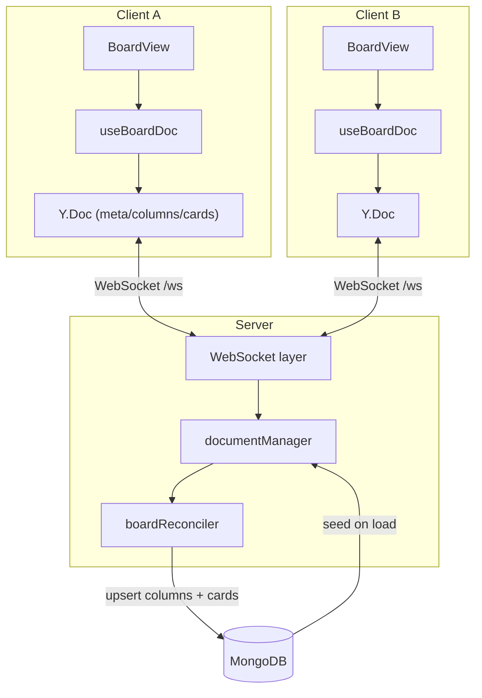

# Real-time Collaboration

Kanban-Collab's headline feature is that a board updates **live** across connected clients. This is delivered by a Yjs **CRDT** synchronised over a WebSocket channel, projected back into MongoDB. This document explains the moving parts.

## How it fits together



Each client keeps a local `Y.Doc` for the board and syncs binary Yjs updates with the server, which relays them to the other clients on the same board and periodically reconciles the document into MongoDB.

## Connecting

The client opens a WebSocket to the API:

```
ws(s)://<host>/ws?token=<accessToken>&boardId=<boardId>
```

- **Path** must be exactly `/ws`.
- **Auth**: the access token is verified on upgrade; the user must be a member of the board's workspace.
- The **board id is the document name** — one Yjs document per board.
- Reconnection uses **exponential backoff**; the client surfaces a `"reconnecting"` status.

> Known gap: the access token is carried in the query string today. The intended design is a WebSocket **subprotocol** (`kanban.auth`) — defined in `shared/constants/websocket.ts` — which avoids leaking the token into logs and browser history. Not yet implemented.

## The collaborative document

The Yjs document has a fixed shape (mirrored on both sides — `server/src/interfaces/websockets/collaboration/yjs/boardSchema.ts` and `client/src/collaboration/boardDoc.ts`):

| Root type | Kind | Contents |
|---|---|---|
| `meta` | `Y.Map` | `{ id, workspaceId, name, description, … }` — board-level fields |
| `columns` | `Y.Map` | `columnId → CollabColumnRecord` (each record's `cardIds` is ordered) |
| `cards` | `Y.Map` | `cardId → CollabCardRecord` |

`CollabCardRecord` carries `title`, `description`, `dueDate`, `members`, `labels`, `checklists`, `orderIndex`, `isArchived`, plus its `columnId`/`boardId`/`workspaceId`. `CollabColumnRecord` carries `name`, `orderIndex` and an ordered `cardIds`.

Card create/update/delete/move and column add/rename/delete all travel through the document. (Board rename and column reordering still go via REST — see the gaps below.)

## Client side

| File | Role |
|---|---|
| `collaboration/YjsProvider.ts` | Opens the socket, wires Yjs sync/awareness |
| `collaboration/boardDoc.ts` | Reads/writes the `meta`/`columns`/`cards` structure |
| `collaboration/useBoardDoc.ts` | React hook that binds a `Y.Doc` to board state |
| `collaboration/useCursors.ts` | Local cursor broadcasting |
| `collaboration/awareness.ts` | Presence/awareness helpers |
| `collaboration/origins.ts` | Origin tags used to ignore echo updates |

`BoardView` consumes the document via `useBoardDoc`, so edits made locally are applied to the CRDT and propagated, and remote edits arrive as Yjs updates.

## Server side

| File | Role |
|---|---|
| `server/server.ts` | Creates the `noServer` WebSocket server, wires `upgrade` and shutdown |
| `server/upgrade.ts` | Parses + authenticates the upgrade request |
| `middlewares/authenticate.ts` / `authorize.ts` | Token verification / membership check |
| `server/yWebSocket.ts` | Per-connection lifecycle: register, sync step 1, messages, close |
| `yjs/documentManager.ts` | Registry of live `Y.Doc`s (create/load, clients, destroy) |
| `yjs/messageHandler.ts` + `syncProtocol.ts` | Decode + dispatch sync messages |
| `yjs/updateBroadcaster.ts` | Fans document updates out to connected clients (skips the origin) |
| `yjs/awarenessProtocol.ts` | Applies inbound awareness updates |
| `collaboration/heartbeat/*` | Ping/pong liveness |
| `collaboration/lifecycle/idleCleanup.ts` | Frees documents after they go idle |
| `collaboration/lifecycle/gracefulShutdown.ts` | Persists + destroys documents on shutdown |

On connect, the server loads (or creates) the board's document, registers the client, and sends a Yjs **sync step 1**. Inbound binary messages are decoded and routed to the sync or awareness handlers. The server does **not** author board state — it relays and persists.

## Persistence & reconciliation

| File | Role |
|---|---|
| `persistence/mongoPersistence.ts` | Loads/saves the document to the `yjsupdates` collection |
| `persistence/debounce.ts` | Debounces writes |
| `persistence/boardReconciler.ts` | Projects the CRDT into `columns`/`cards` documents |
| `persistence/redisSync.ts` | (Intended) cross-instance fan-out via Redis pub/sub |
| `jobs/yjsSnapshot.job.ts` | Periodic snapshot |

State is persisted by writing the encoded Yjs update to `yjsupdates` (keyed by `docName` = boardId), debounced. Separately, `boardReconciler` reads the document and **upserts `Column` and `Card` rows** so ordinary REST queries see the latest state. Reconciliation runs on the debounce, on last-close, and via the snapshot job.

> Known gaps: the reconciler currently reconciles **Column and Card only — never Board** (board-level `meta` isn't written back), and the server **never seeds** the document — reconciliation is a no-op until a client seeds it. The reconciler also trusts client-authored `boardId`/`workspaceId` fields, and its prune step can remove rows the CRDT omits. These are tracked items.

## Lifecycle

- **Heartbeat** — the server pings periodically and terminates sockets that don't pong; `connectionRegistry` tracks every live connection.
- **Idle cleanup** — when the last client leaves a board, `idleCleanup.schedule()` starts a timer that frees the in-memory document after the idle timeout (persisting it first).
- **Graceful shutdown** — on `SIGINT`/`SIGTERM`, `gracefulShutdown` stops idle timers, closes clients, persists and destroys every document, then closes the server. The heartbeat is stopped and any debounced writes flushed.

## Protocol

- Messages are **binary**; the first byte is an application message type (`CollaborationMessage.Sync`, awareness, …), followed by the Yjs payload.
- The sync handshake follows the standard Yjs protocol (sync step 1 / step 2 / update), with **origin-tagged echo guards** so updates the server itself originated are never sent back to their source.
- Application close codes are in the 4000–4999 range (`shared/constants/websocket.ts`): e.g. `4001 UNAUTHORIZED`, `4003 FORBIDDEN`, `4004 SESSION_EXPIRED` (defined), `4005 HEARTBEAT_TIMEOUT`, `4050 SERVER_SHUTDOWN`.

## Known gaps (roadmap)

| Item | Status |
|---|---|
| Awareness/presence not broadcast to peers | Open — inbound awareness is applied but never fanned out; no join snapshot |
| Redis cross-instance sync not connected | Open — `bindRedisSync` returns early while the client isn't connected |
| Access token in the query string | Open — subprotocol designed, not implemented |
| Authorization ignores board visibility/role | Open — only workspace membership is checked |
| Reconciler: Board not reconciled; server never seeds; trusts client tenant fields; prune can delete rows | Open |
| `SESSION_EXPIRED` never sent | Open — live sockets aren't closed when a token expires |
| Board rename & column reordering still REST-only | By design (partial CRDT coverage) |

These are the highest-value items on the collaboration roadmap. Fixing the reconciler's trust of client-authored fields is the most important.
